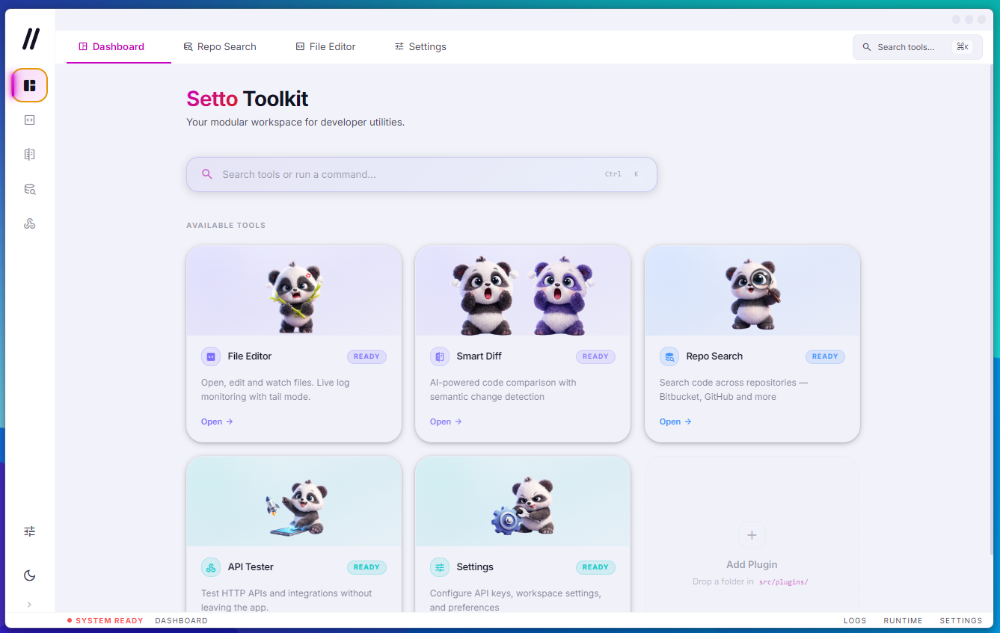
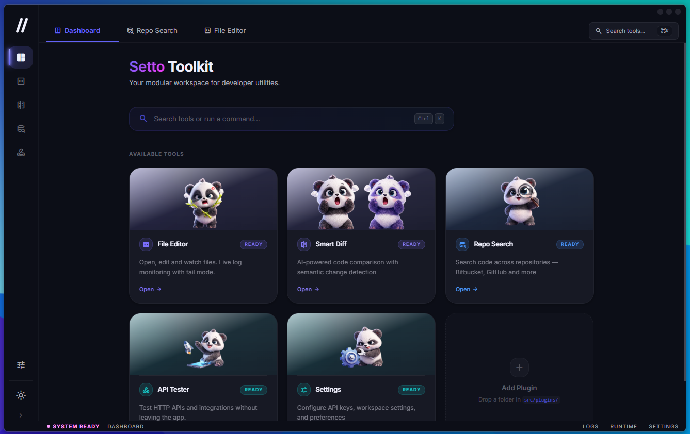

# Setto Toolkit

**Setto Toolkit** es una aplicación de escritorio modular para desarrolladores, construida con Electron + React + TypeScript. Reúne en un solo lugar las utilidades del día a día: edición de archivos, comparación de código con IA, búsqueda en repositorios y prueba de APIs.

<table>
  <tr>
    <td></td>
    <td></td>
  </tr>
</table>

---

## Herramientas incluidas

| Plugin | Descripción |
|---|---|
| **File Editor** | Abrí, editá y guardás archivos. Soporte para logs grandes con modo tail, file watcher y búsqueda en archivos. Menú contextual en tabs (Rename, Save, Copy Path, Reveal in Explorer). |
| **Smart Diff** | Comparación semántica de dos fragmentos de código con análisis de IA (OpenAI / Anthropic / Ollama). Detecta cambios de lógica, efectos secundarios y sugiere mejoras. Vista side-by-side con word-level diff. |
| **Repo Search** | Buscá código en todos los repositorios de tu workspace. Soporta **Bitbucket**, **GitHub** y **GitLab**. Autenticación por PAT (Personal Access Token). Las credenciales se guardan encriptadas localmente con `safeStorage`. |
| **API Lab** | Cliente HTTP similar a Postman. Soporta colecciones, entornos con variables, historial con filtro por URL/método, autenticación Bearer / Basic, multipart/form-data y scripts pre/post-request. |
| **Snippets** | Manager de snippets de código y notas. Soporte de imágenes inline (drag & drop / paste), sintaxis resaltada con CodeMirror, colecciones, pins, búsqueda fuzzy y export/import a JSON. |
| **Ticket Resolver** | Análisis y resolución de tickets Jira asistido por IA (solo API, sin CLI). Fetchea el ticket, genera un plan de análisis, busca código relevante en el repo local y propone causa raíz + fix con diff antes/después. Tipografía y tamaño de fuente configurables por el usuario. |
| **Terminal** | Terminal integrada multi-sesión con pestañas, selector de shell (PowerShell / CMD / Git Bash), restauración de sesiones, integración con Claude Code (launch, stop, indicador de uso % real), atajos Ctrl+T e integraciones cross-plugin. |
| **Settings** | Configuración de API keys, proveedor de IA (OpenAI / Anthropic / Ollama), fuente, tema de color, mascota del dashboard, módulos habilitados y backup/restore de settings. |
| **About** | Información de versión, stack tecnológico y detalles de seguridad de la app. |

---

## Requisitos

- [Node.js](https://nodejs.org/) v22 o superior
- npm v9 o superior

### Requisitos adicionales en Windows (Terminal plugin)

El Terminal plugin usa `node-pty`, un addon nativo de C++ que se compila localmente. En Windows esto requiere:

- **Python 3** → [python.org](https://python.org) — marcar **"Add to PATH"** durante la instalación
- **Visual Studio Build Tools 2019 o 2022** → [visualstudio.microsoft.com/downloads](https://visualstudio.microsoft.com/downloads/) → descargar **"Build Tools for Visual Studio 2022"** → seleccionar workload **"Desktop development with C++"**

> No necesitás Visual Studio completo, solo las Build Tools (gratuitas, ~4 GB). Visual Studio 2017 y versiones preview (2026 Insiders) **no son compatibles** con Node.js 22.

> **¿No necesitás el Terminal plugin?** El `npm install` funciona igual sin estas herramientas — `node-pty` es una dependencia opcional. La app levanta normalmente y solo el Terminal plugin queda deshabilitado.

---

## Instalación y desarrollo

```bash
# Clonar el repositorio
git clone https://github.com/FedeCrossetto/setto-toolkit.git
cd setto-toolkit

# Instalar dependencias
npm install

# Copiar el archivo de entorno y completar credenciales OAuth
cp .env.example .env

# Iniciar en modo desarrollo
npm run dev
```

La app se abre automáticamente como ventana de escritorio (Electron).

---

## Build para producción

```bash
npm run package
```

El instalador queda en la carpeta `release/`. Las credenciales OAuth del `.env` quedan embebidas en el binario en tiempo de compilación — nunca aparecen en el repositorio.

> **Windows:** El build requiere permisos para crear symlinks. Antes de correr `npm run package`, activá el **Modo de desarrollador** (Configuración → Sistema → Para desarrolladores → Modo de desarrollador) o ejecutá la terminal como **Administrador**.

---

## Configuración de credenciales OAuth (build-time)

Las credenciales OAuth se inyectan en el binario en tiempo de compilación via `electron-vite define`. Copiá `.env.example` a `.env` y completá los valores antes de correr `npm run dev` o `npm run package`:

```env
GOOGLE_CLIENT_ID=...
GOOGLE_CLIENT_SECRET=...
GITHUB_CLIENT_ID=...
GITLAB_CLIENT_ID=...
```

El archivo `.env` está en `.gitignore` — nunca se sube al repositorio.

---

## Configuración de credenciales de usuario

Todas las credenciales de usuario se configuran **desde dentro de la app**. Se almacenan encriptadas en el dispositivo mediante `safeStorage` de Electron (DPAPI en Windows, Keychain en macOS).

### Repo Search — Bitbucket

1. Abrí el plugin **Repo Search** y seleccioná la pestaña **Bitbucket**.
2. Ingresá tu usuario, tu workspace y un **App Password** con permisos de lectura de repositorios.
   - Para crear un App Password: Bitbucket → Configuración personal → App passwords → permisos de lectura en Repositories.
3. Hacé clic en **Conectar**. Las credenciales se guardan encriptadas y se reutilizan en sesiones futuras.

### Repo Search — GitHub

1. Seleccioná la pestaña **GitHub**.
2. Ingresá un **Personal Access Token** (classic) con scope `repo` (+ `read:org` si filtrás por organización).
   - Para crear uno: GitHub → avatar → Settings → Developer settings → Personal access tokens → Tokens (classic) → Generate new token.
3. Opcionalmente especificá una organización para acotar la búsqueda.

> El formulario de login incluye el botón **¿Cómo obtenerlo?** con los pasos detallados para cada provider.

### Repo Search — GitLab

1. Seleccioná la pestaña **GitLab**.
2. Ingresá un **Personal Access Token** con scopes `api` y `read_api`.
   - Para crear uno: GitLab → Preferences → Access Tokens.
3. Opcionalmente especificá un grupo para acotar la búsqueda a sus proyectos.

### Smart Diff — Proveedor de IA

Abrí **Settings → AI Service** y elegí el proveedor:

- **OpenAI**: pegá tu API Key y seleccioná el modelo (`gpt-4o-mini` por defecto).
- **Anthropic**: pegá tu API Key y seleccioná el modelo Claude (`claude-haiku-4-5` por defecto).
- **Ollama (local)**: ingresá la URL de tu instancia (`http://localhost:11434`) y el nombre del modelo. No requiere API key.

---

## Mascota del dashboard

El dashboard soporta dos mascotas intercambiables desde **Settings → Appearance → Dashboard mascot**:

- **Setto Avatar** (por defecto): ilustraciones de Setto en cada card. Los PNGs se cargan desde `public/setto-avatar/`.
- **Panda**: mascota original.

Para reemplazar las ilustraciones de Setto: copiá tus PNGs en `public/setto-avatar/` respetando los nombres de archivo (`setto-avatar.png`, `setto-avatar-search.png`, `setto-avatar-difference.png`, `setto-avatar-api.png`, `setto-avatar-settings.png`, `setto-avatar-snippet.png`, `setto-avatar-ticket.png`). Si un archivo no existe, la card oculta la imagen automáticamente.

---

## Agregar un plugin

La arquitectura es completamente modular. Para agregar una nueva herramienta:

1. Crear la carpeta `src/plugins/<nombre>/` con el componente React y su `index.ts`.
2. Si necesita lógica de backend (acceso al sistema de archivos, red, etc.), crear `electron/plugins/<nombre>/handlers.ts`.
3. Registrar el plugin en:
   - `src/core/plugin-registry.ts`
   - `electron/core/plugin-loader.ts` (si tiene handlers)
   - `electron/preload.ts` (agregar los canales IPC necesarios a la allowlist)

Podés usar `src/plugins/_template/` como punto de partida.

---

## Stack tecnológico

- **Electron** — runtime de escritorio
- **React 18 + TypeScript** — interfaz de usuario
- **Vite + electron-vite** — bundler y dev server
- **CodeMirror 6** — editor de código
- **Tailwind CSS** — estilos
- **CodeMirror 6** — viewer de snippets con highlighting por lenguaje (también usado en File Editor)
- **OpenAI / Anthropic / Ollama** — análisis semántico en Smart Diff (multi-proveedor)
- **Fuse.js** — búsqueda fuzzy de snippets
- **chokidar** — file watching en el editor
- **Google OAuth 2.0 PKCE** — autenticación de cuenta Google

---

## Seguridad

- Todos los canales IPC tienen una **allowlist explícita** en el preload — canales desconocidos son bloqueados.
- Las rutas de archivo son validadas en el proceso principal antes de cualquier operación (path traversal + authorized roots).
- Las credenciales sensibles (tokens, API keys) se encriptan con `safeStorage` antes de escribirse a disco.
- El **cache de IA** (`ai-cache.json`) se encripta en disco con `safeStorage` (prefijo `ENCV1:`).
- Las API keys nunca se retornan al renderer en texto plano — se usa un centinela `__CONFIGURED__`.
- El renderer corre con `sandbox: true` y `nodeIntegration: false`.
- Los scripts de pre/post-request en el API Lab corren en un `vm.runInNewContext` aislado con timeout de 2s.
- Las peticiones HTTPS del API Lab validan certificados TLS.
- Las credenciales OAuth (Google, GitHub, GitLab) se inyectan en el binario en build-time desde `.env` (gitignored) — nunca aparecen en el código fuente.
- Los tokens de Google se almacenan cifrados en `google-auth.json` en `userData`.

---

## Changelog

### v2.5.2 — 2026-03-28

#### Ticket Resolver — modo API puro

- Eliminado el orquestador CLI (Claude CLI + `ClaudeCliExecutor`, `ContextCompressor`, `PromptBuilder`, `ResponseParser`, ~1000 líneas). El módulo funciona exclusivamente via API (OpenAI / Anthropic / Ollama).
- Eliminados los 3 canales IPC del orquestador (`orch-extract-terms`, `orch-analyze`, `orch-plan`) y los tipos `FlowState`, `OrchestratorAnalysis`, `OrchestratorPlan`.
- Eliminada la pestaña "Orchestrator" y el componente `OrchestratorView`.

#### Ticket Resolver — fuente configurable

- **Botones `A−` / `A+`** en el header para cambiar el tamaño de texto al instante (Pequeño / Normal / Grande) sin abrir configuración. Indicador `S/M/L` entre los botones.
- **Selector de tipografía** en Config → Visualización: Sistema, Sans, Mono, Serif. Cada botón se renderiza en su propia fuente para previsualizar.
- Ambas preferencias persisten en settings (`ticket-resolver.ui.font_size`, `ticket-resolver.ui.font_family`).

#### Repo Search — mejoras de login

- **Ayuda contextual de token**: link "¿Cómo obtenerlo?" junto al campo de token que expande pasos numerados específicos para cada provider (GitHub / GitLab / Bitbucket).
- **Eliminado el login con Google** del formulario de Repo Search. La autenticación es únicamente por PAT.
- **Botones redondeados corregidos**: `rounded-full` → `rounded-lg` en el botón "Connect" y en los chips de sugerencias.

#### Correcciones de bugs

- **Bug crítico**: el botón "Clear" del historial de búsqueda en Repo Search llamaba a `saveHistory()` (función inexistente) — corregido a `window.api.invoke('repo-search:history-save', [])`.
- **Dead code**: eliminado el fallback a sesión Google en el `useEffect` de inicialización de Repo Search.

---

### v2.5.1 — 2026-03-27

#### Snippets — columnas colapsables

- Las columnas **Filters/Collections** y **Lista de snippets** son ahora colapsables individualmente.
- Al colapsar queda una tira de `w-8` con el título rotado verticalmente. Clic en cualquier punto de la tira para volver a expandir.
- Botón `‹` en el header de cada columna para colapsar. Transición animada `transition-[width]`.

#### File Editor — sidebar colapsable

- El sidebar izquierdo (Explorer + Open Files) es ahora colapsable con el mismo patrón visual: tira delgada con título "Explorer" rotado + `›` para expandir.
- Botón `‹` agregado en el header de "Open Files".

#### Find in Files — búsqueda en archivos abiertos

- Ahora busca directamente en el contenido de las pestañas abiertas, sin necesidad de tener una carpeta abierta.
- Selector de scope: **Open tabs** (búsqueda client-side instantánea) o cualquier carpeta abierta (búsqueda en disco vía IPC).
- Soporte de regex en ambos modos.

#### Quick Open (Ctrl+P) — incluye pestañas abiertas

- Muestra archivos de las pestañas abiertas aunque no haya una carpeta seleccionada.
- Mensaje informativo cuando no hay nada abierto.

#### Correcciones y mejoras de robustez

- `better-sqlite3` y requisitos de compilación en Windows documentados en README.
- Mensajes de error de Ollama traducidos al inglés (`'Ollama devolvió JSON inválido'` → `'Ollama returned invalid JSON'`).
- **OpenAI** ahora acumula `inputTokens` / `outputTokens` / `calls` igual que Anthropic (el token tracking estaba ausente para ese proveedor).
- `editor:create-file` / `editor:create-dir` muestran toast de error en lugar de loguear silenciosamente por consola.
- Split de archivos con `:` en el nombre en multipart/form-data del API Lab corregido.
- Fragment wrapper faltante en `SnippetManager` que rompía el modal de confirmación de borrado.
- Condición redundante en `FindInFiles` simplificada.

---

### v2.5.0 — 2026-03-27

#### Terminal — nuevo plugin

Plugin de terminal integrada construida sobre **node-pty** + **xterm.js**.

- **Multi-sesión con pestañas**: abrí N terminales simultáneas, cada una con su propia pestaña. Clic en la pestaña activa para renombrarla.
- **Selector de shell**: botón `+` con dropdown para elegir entre PowerShell, Command Prompt, PowerShell Core y Git Bash.
- **Restauración de sesiones**: al cerrar y reabrir la app, las sesiones abiertas (shell + nombre personalizado) se restauran automáticamente desde `terminal-startup.json`.
- **Shortcut Ctrl+T**: abre una nueva sesión de terminal desde cualquier lugar de la app.
- **Panel de historial**: registro de sesiones anteriores con duración, cwd y shell.
- **Panel de configuración**: fuente, tamaño, tema de color, cursor, scrollback, shell por defecto.
- **Fix EPIPE**: las excepciones `EPIPE` de ConPTY al cerrar procesos ya no crashean la app (handler nombrado con `removeListener` + re-throw para errores no-EPIPE).

#### Terminal — integración Claude Code

- **Botón Claude**: lanza `claude --dangerously-skip-permissions` en la sesión activa (o crea una nueva si no hay ninguna).
- **Botón Stop**: envía `Ctrl+C` a la sesión activa para interrumpir/salir de Claude sin matar la terminal.
- **Indicador de uso %**: lee directamente los archivos JSONL de `~/.claude/projects/` — sin ejecutar ningún comando en la terminal. Calcula `(input_tokens + cache_creation_input_tokens + cache_read_input_tokens) / 200 000`. Se actualiza automáticamente cada 30 segundos mientras Claude está corriendo y al hacer clic en el botón. Popover con barra de progreso, contexto usado y restante.

#### Terminal — integraciones cross-plugin

- **"Open Terminal Here"** (desde File Editor): clic derecho en el árbol de archivos → abre una nueva sesión de terminal con el `cwd` del directorio seleccionado.
- **"Run in Terminal"** (desde Snippet Manager): botón en snippets de tipo `bash` que envía el contenido a la terminal activa (o crea una nueva si no hay ninguna).
- **"Send to Diff"**: botón en la toolbar de la terminal que vuelca el buffer visible al Smart Diff.

#### Terminal — dashboard card

- Nuevo card en el Dashboard con artwork dedicado: `panda-console.png` (panda) y `setto-avatar-console.png` (Setto).

#### File Editor — reordenamiento por drag & drop

- **Tab bar**: arrastrá cualquier pestaña horizontalmente para cambiar su posición. Indicador visual (borde izquierdo azul) en la pestaña destino.
- **Panel "Open Files"**: arrastrá cualquier ítem verticalmente para reordenarlo. Indicador visual (línea superior azul) en el ítem destino.
- Ambas zonas comparten el mismo estado de drag: también podés arrastrar entre panel y tab bar.
- El drag a Smart Diff sigue funcionando igual (drop fuera de la tab bar).

---

### v2.4.1 — 2026-03-26

#### Shell principal (todos los módulos)

- **Card flotante unificada** (`App.tsx`): el área de pestañas y el contenido de los plugins comparten un mismo contenedor con `border-radius: 18px`, márgenes `40px` arriba, `8px` derecha, `44px` abajo y `6px` izquierda (respecto al TitleBar y a la StatusBar flotante), sombra suave y fondo `rgb(var(--c-background))`. Ticket Resolver, History y el resto de plugins se renderizan dentro de este bloque con bordes redondeados visibles.

#### Sidebar

- **Token `--c-sidebar`** (`globals.css`): color del panel por tema — claro `#14141C`, oscuro `#1E2030` (algo más claro que el fondo de contenido para que el sidebar se distinga en dark mode).
- **Forma del panel**: las cuatro esquinas redondeadas a `16px` (incluidas superior e inferior derecha).
- **Posición**: márgenes `top` / `bottom` respecto al viewport para separar el panel del borde superior y del footer; alineación con la zona de pestañas.
- **Item activo**: muescas cóncavas arriba y abajo; **sin transición** en `background` / `width` / `border-radius` del botón para evitar el flash de fondo oscuro al cambiar de ítem; `z-index` en el wrapper del ítem activo.
- **Logo Setto**: tamaños `48px` (sidebar colapsado) y `46px` (expandido).

#### StatusBar

- **Barra flotante**: `bottom: 8px`, `border-radius: 12px`, posición horizontal `left: anchoSidebar + 6px` y `right: 8px` para alinearla con la card principal.

---

### v2.4.0 — 2026-03-26

#### Ticket Resolver — refactor visual completo

- **Animaciones CSS**: se inyectan estilos globales al montar el plugin (`tr-fadein`, `tr-shimmer`, `tr-pop`, `tr-pulse`) para transiciones coherentes sin depender del sistema de clases de Tailwind.
- **`TicketDetailCard`**: nuevo diseño con skeleton loading mientras se fetchea el ticket, descripción expandible y badge de prioridad con color de fondo diferenciado.
- **`PlanCard`**: rediseñado con chips de metadata (componente, tecnología, tokens estimados, términos), barra de progreso de pasos con indicador de porcentaje y estado "Completado" por paso.
- **`AnalyzingPanel`**: barra de progreso global durante el análisis, con conteo de pasos completados / totales.
- **`CommentCard`** (nuevo): genera un comentario estructurado listo para pegar en el ticket de Jira — tres secciones (Causa del error, Solución, Cómo probarlo) con botón de copia del bloque completo.
- **`DisplaySettings`** (nuevo): panel de configuración visual inline dentro del engranaje de config — font size (small / normal / large), densidad de cards (compact / comfortable) e interlineado (tight / normal / relaxed). Las preferencias se persisten por sesión.
- **`TokenCounter`** (nuevo): contador de tokens de sesión en el header — muestra tokens totales, desglose in/out, porcentaje de uso de la ventana de contexto (200k) con barra de colores (verde → naranja → rojo), y botón de reset.
- **Tabs en el panel de configuración**: el engranaje abre ahora dos pestañas — "Conexión" (Jira URL / email / token / repo / prefijo) y "Visualización" (DisplaySettings).
- **`Skel`**: nuevo componente de skeleton genérico reutilizable dentro del plugin.
- **`TicketComment`**: nuevo tipo en `types.ts` con campos `causa`, `solucion` y `comoProbarlo`.

#### AI Service — token tracking y Ollama mejorado

- **Token tracking por sesión**: `AIService` acumula `inputTokens`, `outputTokens`, `calls` y `contextWindowSize` (200k) durante la sesión. Métodos `getSessionUsage()` y `resetSessionUsage()`. Nuevo canal IPC `ticket-resolver:ai-usage-get`.
- **Anthropic**: los tokens de uso se leen de la respuesta de la API y se suman al acumulador de sesión.
- **Ollama timeout configurable**: nuevo campo en Settings (5–120 min, default 30). El timeout se aplica via `http.request` nativo en lugar de `fetch` para soportar respuestas lentas de modelos grandes.
- **Ollama HTTPS**: el cliente detecta automáticamente el protocolo de la URL (`http` / `https`) y usa el transport correspondiente.
- **`think: false`**: se envía en el body de Ollama para desactivar el modo de razonamiento lento en modelos como `qwen3`, `deepseek-r1`, etc.

#### Settings — modelos Anthropic actualizados y Ollama timeout

- **Modelos Anthropic**: lista actualizada — `claude-haiku-4-5-20251001`, `claude-sonnet-4-5-20251001`, `claude-sonnet-4-6`, `claude-opus-4-6`. Modelo por defecto cambiado a `claude-sonnet-4-5-20251001`.
- **Ollama Timeout**: nuevo campo numérico (5–120 min) con descripción orientativa para modelos grandes en CPU.
- **Iconos de módulos en Lucide**: la lista de plugins habilitados en Settings usa `PluginIcon` (Lucide) en lugar de `<span class="material-symbols-outlined">`.

#### Core — `pluginIcons.tsx` (nuevo archivo)

- Centraliza el mapeo de los icon strings de los manifests de plugin a sus componentes Lucide correspondientes.
- Exporta `PluginIcon` con props `icon`, `size`, `className` y `style`.
- Usado en Sidebar, SettingsPage y cualquier lugar que necesite renderizar el ícono de un plugin sin depender de Material Symbols.

#### Migración a Lucide (Sidebar y About)

- **Sidebar**: los iconos de navegación de plugins ahora usan `PluginIcon` (Lucide) en lugar de `<span class="material-symbols-outlined">`. Los botones de colapso usan `ChevronLeft` / `ChevronRight`.
- **About**: los íconos de las cards de información usan componentes Lucide (`ShieldCheck`, `Database`, `Lock`, `Wrench`, `Tag`) en lugar de Material Symbols.

#### Handlers — robustez y calidad de prompts

- **Detección de respuesta no-JSON de Jira**: `ticket-resolver:fetch` verifica el `content-type` antes de parsear — si Jira retorna HTML (p. ej. redirección a SSO o login), lanza un mensaje de error claro con instrucción de verificar la URL en Settings.
- **Prompts reforzados en español**: los handlers de `plan` y `analyze` incluyen instrucciones explícitas y redundantes para que la IA responda íntegramente en español (`REGLA ABSOLUTA E INQUEBRANTABLE`).
- **`ticketComment` en el resultado**: el handler `ticket-resolver:analyze` incluye el campo `ticketComment` en el JSON solicitado a la IA — causa raíz, solución y pasos de prueba, todos en español.

---

### v2.3.1 — 2026-03-25

#### UI — Layout flotante

- **Sidebar**: panel completamente redondeado (`border-radius: 16px`), fondo propio (`--c-sidebar`), flotante con márgenes superior e inferior. Los iconos inactivos usan color blanco semitransparente para mejor contraste sobre el fondo oscuro del panel.
- **Main content card**: todo el contenido principal (TabBar + plugins) envuelto en una card flotante con `border-radius: 18px`, margen de 40px arriba (respeta el TitleBar), 8px derecha, 44px abajo y 6px izquierda — separado visualmente del sidebar.
- **StatusBar flotante**: la barra de estado pasa de ser full-width pegada al borde a una card flotante con `border-radius: 12px`, `bottom: 8px`, alineada con la card principal. Mismo fondo que el sidebar.
- Los tres paneles principales (sidebar, content card, statusbar) son ahora elementos flotantes independientes con márgenes y radios consistentes.

#### Dashboard

- **Ticket Resolver card**: la card del Ticket Resolver en el dashboard ahora muestra `setto-avatar-ticket.png` (robot Setto con ticket de checkmark) como artwork. Acento y glow en verde/teal (`#0FAD77`).

#### Seguridad / Bugs

- **`repo-search.gitlab.client_id` en allowlist**: la clave faltaba en `ALLOWED_KEYS` del handler de settings — al guardar la configuración de GitLab lanzaba `"Settings key not permitted"`. Corregido.
- **Validación de `ticketKey` en main process**: el handler `ticket-resolver:fetch` ahora valida el formato del ticket key con `/^[A-Z]+-\d+$/` antes de construir la URL de Jira, evitando path injection.
- **`JSON.parse` sin manejo de error**: los handlers `ticket-resolver:plan` y `ticket-resolver:analyze` envolvían el parse sin try/catch — un JSON malformado de la IA producía errores crípticos. Ahora lanzan mensajes legibles (`"AI returned invalid JSON for analysis plan — try again"`).
- **Timeout en fetch de Jira**: el llamado HTTP a la API de Jira ahora tiene un timeout de 15 segundos via `AbortController` — antes podía colgar indefinidamente si Jira no respondía.

---

### v2.2.2 — 2026-03-25

#### Smart Diff

- **Botón Cancelar diff**: nuevo botón que aparece junto a "Compare" cuando hay un diff activo. Descarta el resultado del diff y los insights de IA manteniendo ambos archivos cargados en los editores — sin necesidad de volver a abrirlos.
- **Detección de archivos idénticos**: cuando los archivos comparados no tienen diferencias, aparece un banner centrado con el mensaje *"There are no differences between files."* superpuesto sobre los paneles de código, con un enlace "Dismiss". La sección de estadísticas del sidebar muestra un ícono de check y *"Files are identical"* en lugar de los contadores +0 / -0. El OverviewRuler se oculta en este caso.
- **Token de gradiente**: el botón "Analyze with AI" ahora usa `var(--gradient-brand)` en lugar de un gradiente hex hardcodeado, consistente con el resto de la app.

#### Repo Search

- **Traducción completa al inglés**: todos los textos de interfaz en español reemplazados por inglés — botones (Search, Connect, Clear, Copy, Open, Sign out, Add alias), labels (Repositories, Filter by repo, Repo aliases, Connected as, Searching in, Suggestions, History, Results, No aliases defined, No matches), placeholders, banners de error, estados de carga, panel "Coming soon" de GitLab y acciones de las cards de resultados.
- **Token de gradiente**: el botón Search, el botón Connect, los puntos animados del loader y el ícono de la card de estadísticas ahora usan `var(--gradient-brand)` en lugar de valores hex hardcodeados.

---

### v2.3.0 — 2026-03-25

#### Nuevo plugin: Ticket Resolver

Plugin para analizar y resolver tickets de Jira (WinSystems / wigos) asistido por IA.

**Flujo:**
1. Ingresás el número de ticket (ej. `1234` o `WIN-1234`) — el prefijo se completa automáticamente según la configuración.
2. La app fetchea el ticket de Jira via REST API v3 y genera un **plan de análisis** con AI (~300 tokens): componente afectado, tecnología, naturaleza del problema y términos de búsqueda.
3. Revisás el plan y confirmás la ejecución.
4. El sistema **busca código relevante** en el repo local de wigos (grep quirúrgico, sin AI).
5. Un segundo llamado AI (~800–1500 tokens) genera **causa raíz + fix propuesto + diff antes/after** con el contexto exacto encontrado.

**Características:**
- Clasificación dinámica del problema (no categorías hardcodeadas) — el AI infiere componente y tecnología del ticket.
- Búsqueda de código limitada a extensiones `.cs`, `.vb`, `.ts`, `.js`, `.sql`, `.xml`, `.config` — omite `bin/`, `obj/`, `node_modules/`, `.vs/`, etc.
- Panel derecho de **Code context** con los snippets encontrados (file + line + contexto).
- **Historial persistente** de tickets resueltos (máximo 100 entradas), con búsqueda por clave y navegación rápida.
- Acciones en el resultado: copiar causa raíz, copiar fix completo, guardar en historial, nuevo ticket.
- Config inline (engranaje): Jira URL, email, API token (cifrado con `safeStorage`), path del repo wigos, prefijo de proyecto.
- El commit/push del fix queda **siempre bajo supervisión del usuario** — el módulo no toca git.

**Archivos:**
- `src/plugins/ticket-resolver/` — componente React + tipos + manifest
- `electron/plugins/ticket-resolver/handlers.ts` — handlers IPC
- Settings keys: `ticket-resolver.jira_url`, `ticket-resolver.jira_user`, `ticket-resolver.jira_token` (masked), `ticket-resolver.repo_path`, `ticket-resolver.project_prefix`
- IPC channels: `ticket-resolver:fetch`, `ticket-resolver:plan`, `ticket-resolver:search`, `ticket-resolver:analyze`, `ticket-resolver:history-{get,save,delete}`

---

### v2.2.1 — 2026-03-25

#### UX / Assets

- **Sidebar logo**: reemplazado `setto-logo.png` por `setto_icon.png` (robot Setto). Tamaño aumentado: 44 → 56 px (colapsado) y 52 → 64 px (expandido).
- **App icon**: el `.ico` de la ventana y taskbar pasa a usar `setto_icon.ico` (256×256, 32bpp) en lugar de `dev-logo.ico`. Actualizado en `electron/main.ts` y `package.json`.
- **Reorganización assets panda**: los PNGs del mascot panda se movieron de `public/` a `public/panda-avatar/`. Referencias actualizadas en `Dashboard.tsx` y `RepoSearch.tsx`.

#### File Editor

- **Drag handle Explorer ↔ Open Files**: altura aumentada de 5 px a 10 px, se agregó `touch-action: none` y `setPointerCapture` para drag más confiable (no se corta al mover el mouse rápido).
- **Scrollbar global**: ancho aumentado de 5 px a 8 px — más fácil de agarrar en el árbol de archivos y demás paneles con scroll.

---

### v2.2.0 — 2026-03-24

#### Nuevas funcionalidades

**Plugin: Snippet Manager**
- Nuevo plugin completo para gestión de snippets de código y notas.
- Tres paneles: navegación (colecciones / all / pinned), lista y detalle/editor.
- Viewer de código de solo lectura con **CodeMirror 6** y resaltado de sintaxis por lenguaje (JavaScript, TypeScript, Python, SQL, JSON, HTML, CSS, Bash, Java, C#, Go, Rust, YAML, XML, Markdown).
- Soporte de **imágenes inline** al estilo Notion: pegá (`Ctrl+V`) o arrastrá una imagen directamente en el editor — se inserta como marcador `![img:id]` visible y compacto en la edición, y se renderiza como imagen real en el viewer.
- `MixedContentViewer`: renderiza snippets que mezclan texto/código e imágenes en bloques intercalados.
- Colecciones, pin, tags y descripción por snippet.
- Búsqueda fuzzy con Fuse.js sobre título, contenido, tags y descripción.
- **Export/Import a JSON**: exportá todos tus snippets y colecciones a un archivo, importalos en otra máquina — las colisiones de ID se omiten automáticamente.
- Atajos de teclado: `Ctrl+N` (nuevo snippet), `Ctrl+Enter` (guardar), `Escape` (cancelar).
- Card en el Dashboard con artwork diferenciado por mascota (Setto y Panda).

**API Lab — mejoras**
- Nuevo icono: `rocket_launch`.
- **Buscador de URL en el historial**: filtrá las entradas del historial por texto en la URL en tiempo real, combinable con el filtro por método HTTP.
- **Botón Retry**: aparece junto al mensaje de error en el panel de respuesta para reintentar con un click.
- **Badge de entorno activo**: muestra el nombre del environment seleccionado directamente en la URL bar — desaparece cuando no hay ninguno activo.

#### Mejoras de UX / UI

- **Dashboard**: las cards entran con animación `fadeSlideUp` escalonada (60ms entre cada card).
- **Sidebar**: logo corregido en modo colapsado — era 128px en un contenedor de 68px, ahora 44px.
- **Settings**: sección "Integraciones" y todas las descripciones en español traducidas al inglés para consistencia.
- **CommandPalette**: instancia de Fuse envuelta en `useMemo` — deja de re-crearse en cada render.

#### Seguridad

- **Content-Security-Policy**: CSP aplicado vía `session.defaultSession.webRequest.onHeadersReceived`. Restringe `script-src`, `style-src`, `font-src`, `img-src` y `connect-src` a orígenes explícitamente permitidos.
- **`settings:getAll` prefix allowlist**: el handler ahora valida el prefijo contra una lista explícita (`ai`, `repo-search`, `dashboard`, `bitbucket`, `editor`) — prefijos arbitrarios son rechazados.

---

### v2.1.0 — 2026-03-24

#### Nuevas funcionalidades

**Google OAuth (Repo Search)**
- Nuevo servicio `AuthService` con flujo **OAuth 2.0 PKCE para Desktop** — abre un servidor HTTP local en localhost para recibir el callback.
- Nuevo componente `GoogleAuthWidget` disponible en cada proveedor de Repo Search como alternativa al PAT.
- Al iniciar sesión con Google, la app carga la interfaz de búsqueda mostrando el email y avatar de la cuenta Google.
- Si no hay PAT configurado para el proveedor, aparece un banner amigable "NOT_AUTHENTICATED" con enlace para conectar token.
- Las sesiones son independientes por proveedor — iniciar sesión con Google en GitHub no afecta GitLab ni Bitbucket.
- Los tokens de Google se almacenan cifrados con `safeStorage` en `google-auth.json`.

**Avatar en "Conectado como"**
- Al autenticar con PAT, la sección "Conectado como" muestra el avatar del usuario (obtenido de la API del proveedor).
- Al autenticar con Google, muestra la foto de perfil de la cuenta Google.
- Si no hay avatar disponible, muestra un ícono genérico de persona.

**Logos de proveedor en el login**
- El formulario de login de cada proveedor muestra el logo correspondiente (GitHub, Bitbucket, GitLab) como SVG inline.

**GitHub tree search fallback**
- Cuando la API de búsqueda de código de GitHub devuelve 0 resultados (repo recién creado / sin indexar), la búsqueda cae automáticamente a un escaneo directo del árbol de archivos vía `raw.githubusercontent.com`.

**Setto Avatar — sistema de mascotas**
- Nuevo conjunto de ilustraciones `Setto Avatar` como mascota alternativa al panda.
- Los PNGs se sirven desde `public/setto-avatar/` con fallback automático si el archivo no existe.
- Selector en **Settings → Appearance → Dashboard mascot**.
- El mascot seleccionado también aplica al loader de búsqueda en Repo Search (muestra setto-avatar-search o panda-search según la preferencia).
- **Setto Avatar es la mascota por defecto** en instalaciones nuevas.
- El cambio de mascota se propaga en tiempo real a todos los tabs abiertos vía evento `mascot-change`.

**Credenciales OAuth embebidas en build-time**
- Google Client ID/Secret, GitHub Client ID y GitLab Client ID se inyectan en el binario vía `electron-vite define` desde `.env`.
- El archivo `.env.example` documenta las variables requeridas.
- Los usuarios finales no necesitan configurar nada — solo hacer click en "Sign in".

#### Cambios de nombre

- **API Tester** renombrado a **API Lab** en toda la interfaz.

#### Mejoras de UX

- **Dashboard Smart Diff card**: columna de artwork ampliada al 55% para acomodar correctamente la imagen landscape `panda-compare-files.png` sin recorte.
- El loader de búsqueda respeta la preferencia de mascota activa.
- Settings muestra Setto Avatar seleccionado por defecto en instalaciones nuevas.

#### Fixes

- Eliminado `app.setAppUserModelId` duplicado en `main.ts` (se llamaba dos veces con IDs distintos).
- Eliminados todos los `console.log` de debug del handler de repo-search (URLs de búsqueda, contadores de archivos, fallback logs).

---

### v2.0.0 — 2026-03-23

#### Nuevas funcionalidades

**Multi-proveedor AI (Smart Diff)**
- Soporte para **OpenAI**, **Anthropic Claude** y **Ollama** (local, sin API key).
- Selector de proveedor en Settings con campos condicionales por proveedor.
- Los modelos disponibles se listan en un dropdown por proveedor.

**API Lab — Scripts pre/post-request**
- Nuevo tab **Scripts** en cada request.
- El script de pre-request puede mutar variables de entorno antes del envío (`pm.environment.set/get`).
- El script de post-response accede a `pm.response.status`, `pm.response.json()`, `pm.response.body`.
- Ejecución sandboxada via `vm.runInNewContext` con timeout de 2 segundos.

**API Lab — Soporte multipart/form-data**
- Nuevo body type `form-data` con editor de campos clave/valor.
- Soporte para adjuntar archivos directamente desde el editor.

**Repo Search — GitLab**
- Tercera pestaña de proveedor con autenticación por Personal Access Token.
- Búsqueda de código por scope `blobs` en todos los proyectos accesibles o en un grupo específico.
- Token almacenado cifrado con `safeStorage`.

**Historial de búsqueda persistido (Repo Search)**
- El historial de queries deja de usar `localStorage` y se guarda en `userData` via IPC (`repo-search-history.json`).
- Persiste entre reinstalaciones del renderer y está disponible en el proceso principal.

**Backup & Restore de settings**
- Nuevo botón **Export JSON** en Settings: guarda configuración no sensible (modelos, workspace, aliases) en un archivo local.
- Botón **Import JSON**: carga y aplica la configuración desde un archivo. Las API keys nunca se exportan ni importan desde archivo.

**Plugin About**
- Nueva pantalla con versión de la app, stack tecnológico y detalles de seguridad.

#### Mejoras de UX

- **Dirty indicator**: punto de color en el tab del File Editor cuando hay cambios sin guardar.
- **Modal de confirmación** al eliminar archivos/carpetas (reemplaza `window.confirm`).
- **ErrorBoundary por plugin**: si un plugin falla, muestra un card de error con botón "Try again" sin romper el resto de la app.
- **Toast system**: notificaciones no bloqueantes en esquina inferior derecha (success / error / warning / info).
- **Sidebar collapse persistido**: el estado colapsado/expandido de la barra lateral se guarda en `localStorage`.
- **Word-level diff**: en Smart Diff, las líneas modificadas resaltan las palabras exactas que cambiaron (no solo la línea completa).
- **AI Insights scrolleable**: el panel de análisis de IA en Smart Diff tiene altura mínima y scroll interno.
- **Banner de onboarding**: aparece en el Dashboard si no hay proveedor de IA configurado, con acceso directo a Settings.

#### Seguridad

- **AI cache encriptado**: `ai-cache.json` se cifra con `safeStorage` (prefijo `ENCV1:`). Migración transparente desde archivos planos existentes.
- **Anthropic key cifrada** con `safeStorage` (mismo mecanismo que OpenAI key y tokens de Bitbucket/GitHub).
- **GitLab token cifrado** con `safeStorage`.
- **Settings allowlist ampliada**: nuevas keys de AI y GitLab validadas explícitamente en el handler de IPC.
- **Authorized roots para File Editor**: las operaciones de escritura/borrado solo se permiten en directorios previamente autorizados por el usuario.

---

### v1.0.1 — 2026-03-22

#### Repo Search — mejoras de UI y funcionalidad
- **Agrupación por repo** con secciones colapsables y contador de matches por grupo.
- **Alias de repos** configurables desde la sidebar: mapeá nombres de repositorios a un alias común y los resultados se fusionan en un único grupo.
- **Estado persistente por proveedor**: al cambiar entre las pestañas Bitbucket y GitHub los resultados y la búsqueda anterior se conservan.
- **Historial de búsqueda** guardado en `localStorage`, con dropdown al enfocar el input y botón para limpiar.
- **Atajos de teclado**: `/` enfoca el input de búsqueda desde cualquier parte de la pantalla.
- **Resaltado de sintaxis** en los snippets de código (keywords, strings, números, comentarios).
- **Path breadcrumb** con segmentos de ruta y branch en cada resultado.
- **Copiar snippet** con feedback visual ("Copiado") en cada card de resultado.
- **Sugerencias en estado vacío** (chips de búsqueda comunes como `TODO`, `FIXME`, `console.log`, etc.).
- **Filtro lateral por repo** con contadores de coincidencias.
- **Estilo**: tabs de proveedor y botón Buscar cambiados de `rounded-full` a `rounded-lg` para coherencia con el resto del diseño.
- **Fix**: solo se muestran las líneas que contienen la coincidencia real; se descartan las líneas de contexto que devuelve la API de Bitbucket.
- **Fix**: error `SyntaxError: Unexpected end of JSON input` en el login de Bitbucket cuando la respuesta HTTP no tenía body JSON.
- **Fix**: soporte multi-proveedor completo (Bitbucket + GitHub) con credenciales aisladas por proveedor.

#### Dashboard
- Cards con zona de artwork transparente: el panda flota sobre el fondo del card sin contraste de color de fondo.
- Glow suave en el color del plugin debajo de cada panda.
- Animación de flotación suave (`pandaFloat`) en todas las ilustraciones.
- Fix: imagen del panda no aparecía en la card de Repo Search (key `bitbucket-search` → `repo-search`).

#### Seguridad (parches aplicados en el commit inicial, documentados aquí)
- IPC allowlist explícita en `preload.ts` — canales desconocidos bloqueados.
- `shell.openExternal` restringido a protocolos `http:` y `https:`.
- Validación de rutas de archivo en todos los handlers del File Editor (null bytes, path traversal, profundidad mínima en delete).
- Tokens y API keys encriptados con `safeStorage` (DPAPI en Windows, Keychain en macOS).
- Reemplazado `execSync` por `execFileSync` con argumentos en array para eliminar inyección de shell.
- Removido `rejectUnauthorized: false` del API Tester (TLS válido requerido).
- Protección SSRF en paginación de Bitbucket (`nextUrl` validado contra la URL base de la API).

---

### v1.0.0 — lanzamiento inicial

- **File Editor**: apertura, edición y guardado de archivos. Modo tail para logs grandes, file watcher y búsqueda en archivos.
- **Smart Diff**: comparación semántica de código con análisis de IA (OpenAI). Detecta cambios de lógica, efectos secundarios y sugiere mejoras.
- **Repo Search**: búsqueda de código en repositorios de Bitbucket y GitHub. Credenciales encriptadas con `safeStorage`.
- **API Tester**: cliente HTTP tipo Postman con colecciones, entornos, historial y autenticación Bearer / Basic.
- **Settings**: configuración de API keys, modelo de IA, fuente y tema de color.
- **Dashboard**: pantalla de inicio con cards animadas por herramienta.
- Arquitectura de plugins modular (IPC handlers + registro de plugins).
- Tema claro y oscuro.

---

## Licencia

MIT
